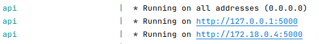

# Introduction
Code for **SAIRUS**, the multimodal classifier for risky users on social media. Currently, it has been used only with 
Twitter data. It is a REST API service. <br>
## Docker
The system can be used through docker. Run the following commands for starting the needed containers:
<br>
``` docker compose build ```<br>
``` docker compose up ```

Some logs will be displayed, containing the IP address of the API (the second one):

## Without docker
If you don't want to use Docker, you will first need to install the dependencies listed in ```requirements.txt```, then
manually install celery and redis, which are the services used for managing the jobs. By running the file [run_redis.sh](run_redis.sh), 
it will first check if redis is installed. If not, it will download it and then run it. Celery needs to be manually installed.
<br>Then run the command 
<br>
```celery -A task_manager/worker.celery worker --loglevel=info``` <br>
Then, the API can be started with the command <br>
```python api.py```
<br>
In this case, the API will run at the IP http://127.0.0.1

## Using the API
Once you have the API IP, you can send requests to it. Find some examples in [test_api.py](test_api.py) or [examples.sh](examples.sh).
Depending on the techniques that you want to use, some parameters are required and some others are not. The system requires links to
some files. Refer to the next paragraph for more information about how the files should be structured.<br>
Once a request is sent, the Job ID will be shown. It can be used for getting information about the status of the training task,
via the ```task_status``` endpoint. Once the training is finished, use the ```predict``` endpoint in order to get predictions. If one or more user IDs
are specified, the model will classify those users. Since the node embedding model is transductive, it can only provide predictions for users that 
it already knows (meaning that it appears in the adjacency matrix or in the edge lists).

## Files format
### Content
The link to the file with the textual content (ie the posts) is always required. The content must be stored into a ```.csv``` file that has at least the following three columns (the order is not important):
* **id**: The user ID
* **text_cleaned**: This column will contain, for each user, the concatenation of the textual content he/she posted. Therefore, every user is represented by a separate row; 
* **label**: This column tells whether the user associated to it is risky (label=1) or safe (label=0).

### Relationships
Depending on the node embedding technique, different files must be provided. 
#### Node2Vec
If the technique adopted if node2vec, then the user must
provide the links to a file containing an edge list. If n2v is going to be used for learning relational embeddings, created from the graph
of users relationships, then the file provided will be named ```social_network.edg```. For each edge, the file must contain a row made
of two values, which are the IDs of the nodes being connected by the edge. Remember that the social relationships are directed, 
therefore if two users have a mutual relationship, they are connected by two edges with opposite direction. If node2vec is going
to be used also for learning embeddings of the spatial users relationships, then the user will have to provide a link to a file named 
```spatial_network.edg``` with a similar structure as the one previously described. The differences are that, in this case, the 
relationships are undirected and weighted with the normalized distance between two nodes. Therefore, for each edge there is a row 
containing three values: the two node IDs, and the distance that separates them.

#### Autoencoder / PCA / None
These techniques work on the adjacency matrix of user relationships. **Autoencoder** takes the rows of the matrix and feeds them
to an autoencoder which reduces the dimensionality. **PCA** performs Principal Component Analysis on the matrix in order to reduce the row
dimensionality. **None** directly uses the rows of the matrix, without performing any dimensionality reduction. These techniques require the user
to provide links to a .csv file containing the adjacency matrix, and an additional link to a .pkl file containing a dictionary having
as keys the user IDs, taken from the ```.csv``` file with the content, and as values the index of the matrix row corresponding to that user.


